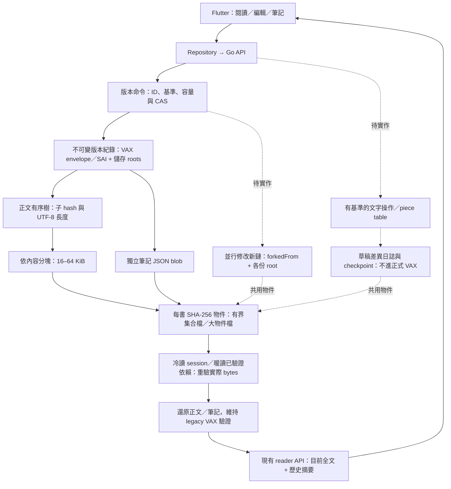

# 內容物件與版本儲存架構

第一階段已實作新匯入書的正文樹、獨立筆記 blob、物件共用及版本讀寫。操作式編輯、按章 API／虛擬排版、差異復原、正式 VAX root 事件、衝突新鏈、卡片發布與舊書遷移仍待完成。

## 資料流與階段



實線是本階段接通的流程；虛線為後續。新資料的儲存 root 承諾物件內容、次序及長度，但正式 VAX 仍承諾還原後的全文／筆記 canonical hash；不能只驗物件 root 就宣稱完成正式 VAX 驗證。

## 實體格式與責任

```text
library/books/{documentId}/
  original.md 或 original.txt       原始 bytes，保持不可變
  manifest.json                    revisionStorage: objects-v1，版本 IDs／head
  versions/{revisionId}.json        storageVersion: 1，revision metadata + 兩個 root
  objects/catalog.pfca             有界二進位集合：typed hash → 原始物件 bytes
  objects/{hash前兩碼}/{hash}.pfo   大物件或集合滿時的 immutable 物件
  drafts/、progress.json            本階段維持原格式
  evidence-wall.json               現行 schema v2 布局，尚無布局 VAX
```

- content/objects.go：雜湊路徑、一般檔案／連結檢查、有界讀取、不可覆寫發布。
- content/tree.go：固定且版本化的 Gear 分塊、UTF-8 字元邊界、16 子項的有序樹建構。
- content/catalog.go：有界二進位集合讀寫、單檔批次載入、溢出回退及先物件後版本的發布。
- content/session.go：物件 hash／型別／次序／長度驗證、共享依賴去重、正文還原及容量／深度限制。
- content/fingerprint.go：暖讀串流重驗已完成 session 的物件依賴，仍檢查實際 bytes。
- library/revision_objects.go：實體紀錄與原有 Revision 的轉接；布局只取 head 筆記，不讀正文樹。
- library/object_history.go：新格式的完整歷史讀取、一次 session、相同正文 root 的 string 共用與 VAX 驗證快取。
- library/versions.go／import.go：既有命令與 CAS；先保存物件／版本，驗證可讀性與容量，再發布 manifest 或新書。

PFCO v1 bytes 是 ASCII PFCO + 版本 byte 1 + kind byte + payload。kind 0 為 UTF-8 正文葉，kind 1 為有序分支，kind 2 為筆記 JSON。物件 ID 是全部上述 bytes 的 SHA-256，型別與版本都在 hash 中，正文／筆記不能互換。

分支 payload 為一個子項數 byte（2–16），依序接每個子項的 32-byte hash 及 8-byte big-endian UTF-8 byte 長度。所有長度需與實際還原相符；不以檔名／mtime 代替內容驗證。空正文使用空葉，單葉即是 root。正文 chunk、樹節點與讀者段落 ID 不同；穩定章節／block ID 合約仍待實作。

Gear 固定表／seed、切分條件、16 KiB 下限、約 32 KiB 目標、64 KiB 上限、UTF-8 邊界與 fanout 是格式合約，不能以 runtime 設定任意改變再仍稱同一格式。目前 PutText 接收全文、掃描所有字元並重新組織分支；相同物件不重寫。依內容切分降低文首插入造成的連鎖重切，並不保證所有輸入或惡意重複文字都能共用相同比例。

筆記目前是整份 notes JSON blob，修改筆記會重寫該 blob，但不重寫已共用的正文；按 noteId 的獨立樹、長筆記文本樹及個人 owner 分離仍待實作。布局、草稿與原始文件不因本階段被重新編碼。

## 發布、驗證與成本

小物件先放入有界集合，Flush 在同目錄寫暫存檔、Sync 再替換 catalog；保留所有已存在的 hash → bytes，不更換物件 ID。PFCA v1 為 ASCII PFCA + byte 1、4-byte big-endian 物件數，接按 hash 排序的條目；每條是 32-byte hash、4-byte big-endian wire 長度及完整 PFCO bytes。載入檢查實際容量、數量、重複 hash、物件 hash、截斷與尾端資料。集合是儲存索引，物件雜湊仍是內容依據。

大物件或集合滿時，物件先寫同目錄暫存檔並 Sync，再以 hard link 建立 hash 名稱，不能覆寫既有物件；已存在時驗證實際 hash 與 bytes，損壞時拒絕而非修補。先 Flush 集合／物件，再保存版本 JSON，最後切 manifest。集合／manifest 替換沿用同目錄 rename；Windows 的發布與斷電原子性尚未完整故障驗收，不宣稱跨平台斷電保證。Hard link 需要檔案系統支援；失敗回報並保留舊 head。

新書在暫存目錄內完整讀回驗證後才發布；正式 Commit 也在切 head 前驗證候選歷史的完整性與容量，超量不會新增一個下一次打不開的 head。失敗可能留下未被索引引用的物件或版本，尚無自動 GC；它們不進已發布歷史。Sync／原子發布不等於已完成斷電故障驗收，各發布階段 crash 與磁碟耗盡仍需另測。

每次讀書都驗證原始檔、版本紀錄與可達物件的實際 bytes，不跨操作信任 mtime。原始檔先串流雜湊；版本 metadata、文件資料／版本序列／儲存格式與原檔 hash 完全吻合已驗證快取時，使用該快取保存的依賴清單，串流重驗 loose 物件與 catalog 中的實際 wire bytes，省下樹解析與全文還原。Catalog 載入時仍驗全部條目，包含未被此 head 引用的物件；有界集合每次載入，沒有全程常駐。

冷讀 session 去重可達依賴、還原與驗 VAX 後，才建立依賴清單；不能拿未驗證 root 或 mtime 直接命中快取。缺物件、錯 hash、錯型別、換 root 後與 VAX 全文承諾不符都拒絕；不宣稱能防止含 head 的整鏈重寫。

冷讀取仍需還原不同正文 roots 並完整驗證每個 legacy VAX 事件。同一次 VAX Verify 對完全相同的正文 string 共用全文 SHA-256；只要文字不同就重算，不依長度或片段推論。相同 root 在一次讀取中共用 immutable string；可變 notes 切片隔離。很多只改一字的版本可能共享磁碟區塊，卻仍產生很多不同的全文 string，故需另檢查還原容量。這是第一階段剩餘瓶頸，不能把磁碟減量等同所有操作只需樹高成本。

Catalog 每次新增物件時重寫有界集合；這避免許多小檔案開啟，但發布仍有集合寫入放大，尚非 append pack。正式提交仍完整驗證候選歷史，保存延遲未在本輪 benchmark 量測。後續 pack 索引／append／GC 須另外設計與故障驗收。

目前 API 仍傳目前全文，Flutter 仍全文 TextField／Markdown 排版。這一階段不解決百萬字輸入延遲；下一階段要把文字操作、分章讀取與可視區排版接進來，同時保留跨段落／全選／複製。

## 配置、相容與遷移

| 設定 | 預設 | 範圍與用途 |
| --- | --- | --- |
| storage.revisionFormat | objects-v1 | legacy 或 objects-v1；只決定新匯入書的格式 |
| storage.objectCount | 100000 | 1–1000000；一次歷史的可達物件及 catalog 條目上限 |
| storage.inlineObjectBytes | 65536 | 0–65536；新物件 payload 的集合門檻，0 停止新增集合條目；既有集合仍讀取 |
| storage.objectCatalogMiB | 8 | 1–32；catalog 實際位元組上限；滿時新物件存 loose 檔，縮小到低於現有大小會拒絕讀取 |
| storage.historyMiB | 256 | 原檔／版本 JSON／不同可達物件的讀取預算；另外限制還原內容與索引容量；集合緩衝另以 objectCatalogMiB 限制 |
| storage.recordMiB | 64 | 版本 metadata／manifest／草稿等 JSON 的單檔上限 |
| storage.verifiedCacheMiB | 64 | 新格式以讀取＋還原的容量估計控制快取；0 不建立新快取 |

單個正文葉上限 64 KiB，筆記 blob 沿用 limits.snapshotNotesMiB（預設 5），根正文的展開長度沿用 limits.textMiB（預設 5）。樹深度最多 32。容量估計與 Go TotalAlloc 均不是程序 RSS 的保證；檔案讀取、解碼與容器有額外成本。未引用 catalog 條目不計入可達歷史預算，避免失敗提交使舊 head 超量；集合整檔緩衝仍受獨立容量上限保護，實際讀取記憶體需另加此成本。objectCount 不限制未引用垃圾檔總數；GC 與實體磁碟總預算為後續工作。

舊書沒有 revisionStorage 欄位，繼續按 legacy 全文 JSON 讀寫，不改寫原版本、SAI 或備份。新書記錄格式後，即使全域改回 legacy，該書仍使用 objects-v1；新舊格式可同庫存在。既有來源去重仍生效，重新匯入完全相同原檔不會偷偷遷移舊書。舊 Web／舊 Native 不支援新物件格式；要給舊程式用，需未來顯式匯出完整 legacy 書庫，不能只刪 marker 或切設定降版。

後續舊書 migration 須另外建立新索引、逐版還原／VAX 比對、保留原始檔及回滾備份；本輪沒有對私人書庫做批次轉換。只有原有 ID 與 legacy SAI 被保留；新的 root 型正式事件、owner／cardInstanceId／新鏈及發布事件沿用各自待實作合約。

## 驗收

測試覆蓋精確 Unicode／換行往返、依內容分塊的文首插入共用、重送同內容不增加物件、正文／筆記型別隔離、有序子項與錯長度、空正文、容量／物件數、錯 hash／缺依賴／mtime 恢復、root 置換與 VAX 不符、原檔及版本不被改寫、還原共用、筆記切片隔離、布局只取筆記、新設定不改舊書、改設定後仍讀新書，以及超量發布失敗仍保留舊 head。

另涵蓋二進位集合截斷、錯長度、重複 hash、超量 count、尾端垃圾、集合容量滿後回退 loose、停用新集合寫入後仍讀既有集合。

Go HTTP 測試使用預設的新匯入格式；原 Web golden fixture、舊儲存回歸及既有長文診斷探針明確保持 legacy，避免混淆原基準。相同文本／40 版的效能對照使用 BenchmarkObjectHistory，結果見 [物件儲存基準](experiments/CONTENT_OBJECTS.md)。


本機驗收：Go 全套測試及 vet、Go Windows sidecar 編譯、Dart 格式檢查（0 修改）、Flutter analyze 均通過；Flutter 48 項測試通過，1 項需 opt-in 的長文 UI 探針未啟用。Windows 連結目錄回歸因環境無建立 symlink 權限而跳過，尚須在支援環境補驗；不能把此項算成已驗收。失敗超量提交後，未引用集合內容不影響舊 head 的冷／暖讀取，另有回歸測試。
