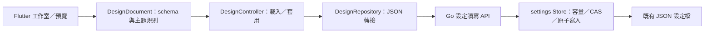

# JSON 外觀工作室

這一階段用來設計 Pageforge 自己的主題、書架及文字閱讀器。
入口是書架右上角的「外觀工作室」。選擇場景，調整屬性，或切換 JSON 編輯。
中央即時預覽使用自製示例文件與正式 BookTile、BookCover、LibraryHeader、ReadingInvitation、ArticleBody 元件。
預覽不讀取私人書籍，也不提交筆記或閱讀進度。

## 已完成

- 全域：紙張、文字、重點、森林、次要文字色彩及標題字體；書店／晨光／墨藍預設。
- 書架：閱讀引導顯示、書卡最大寬度、間距、五種封面線稿或依文件自動選擇。
- 文字閱讀器：文章最大寬度、內文行高及段落額外間距；PDF、XLSX 原生版面不受這些欄位影響。
- 屬性與 JSON 共用一份設計資料；JSON 有 200 ms 防抖，無效輸入保持最後有效預覽。
- 復原／重做保留至多 50 次有效設計；離開時提示尚未套用的調整。
- 「套用並保存」成功才更新正式 UI；失敗保留工作室調整，書籍 VAX、草稿和進度獨立運作。
- 1440、960、600 寬度的工作室排版；窄視窗將屬性與預覽上下排列。

## JSON 合約與保存

預設值在專案／設定根目錄的 pageforge.design.json，與啟動設定 pageforge.config.json 分開。
Go 的通用 settings Store 將完整本機覆寫保存為同目錄的 pageforge.design.local.json；檔案路徑由啟動組裝層固定提供，不接受 HTTP 傳入檔名。不覆寫預設或 library。預設 JSON 是 Flutter 外觀配置，Go 只提供檔案讀取。
build 腳本把預設設計一起放入 Release。PAGEFORGE_PROJECT_ROOT 同時決定這些設定的位置。
本機覆寫不提交 Git，刪除本機覆寫即可恢復預設；外部編輯後重啟，或在工作室重新載入。
尚未提供檔案監聽熱載入。

reader.paragraphGapLines 可設定 0–3 行，預設增加一行，會隨字級及系統文字縮放變化。它只控制視覺間距，保留來源、引用及複製文字；舊設計未指定此欄位時使用 1，不在讀取時覆寫原設定。

schemaVersion 固定為 1；完整欄位與界限見 schema/pageforge-design.schema.json。
僅 Dart DesignDocument 驗證必填欄位、未知欄位、有限數值、字體與圖案列舉及 #RRGGBB 色彩。Go 不維護 Theme／Library／Reader 模型，也不驗證 schemaVersion、顏色或尺寸；儲存只要求單一合法 UTF-8 JSON object 與 byte 上限。因此「Go 可以保存」不表示「Flutter 可以套用」。
外觀 JSON 最大 16 KiB，前後端各自檢查 UTF-8 bytes；HTTP envelope 額外允許 1 KiB，避免合法上限文件因包裝超限。Flutter 嚴格 schema 只描述已實作元件，不允許任意 Dart／JavaScript、檔案路徑或遠端圖片。Go 只把內容當資料，不解譯或執行未知欄位。
缺少、語法損壞或不受目前 Flutter 支援的 schema 會顯示錯誤並以內建外觀啟動；重新載入失敗時保留現有有效外觀。尚未成功讀取不取得可寫 revision；Go 不跳過壞覆寫去用預設，且 CAS 防止用空 token 覆蓋未知版本。需修正設定檔或使用相容客戶端，不靜默覆蓋資料。

GET /v1/design 回傳 document 與 revision；PUT /v1/design 傳入 document、expectedRevision。
revision 是目前設定檔原始位元組的 SHA-256，用於拒絕過期保存；不解析、補欄位或重新排列 JSON。Go mutex 串行保存，先寫暫存檔、Sync，再 rename。傳輸以 json.RawMessage 保留未知資料欄位；Go 不回寫客戶端語意。
API 沿用 loopback、Bearer token、Origin 拒絕與容量限制。
此 hash 是保存衝突檢查，外觀尚未使用 VAX 歷史或建立分支。從舊 Go 模型的重新編碼 hash 切成原始 bytes hash 後，舊 token 可能失效；重新載入即可取得新 token，既有設定檔不需重寫或 migration。

## 責任邊界

- Flutter DesignDocument：不可變外觀 JSON、預設值、schema 版本相容與嚴格驗證。
- Flutter DesignController：載入與套用已保存的全域外觀；DesignRepository 把持久 JSON 解析成前端模型，theme 渲染不由 Go 決定。
- StudioViewModel：工作室調整、復原／重做與套用生命週期。
- StudioScreen／Toolbar／SceneList／Inspector／Fields／JsonEditor：介面組裝與操作。
- StudioPreview：示例資料與正式元件預覽。
- DesignTheme：ThemeExtension，元件從目前 Theme 取得資料；樣式仍和元件放在一起。
- Go internal/settings：只處理不透明 JSON 的結構／容量界限、byte revision、並行保存和原子寫入，與 library／VAX 分開。

## 直接的操作順序

外觀流程按動作依序執行，沒有另建 fluent pipeline 框架：

- 載入：HTTP 解碼 → fromJson 驗證並建立不可變模型 → 發布完整 DesignSnapshot → 通知畫面。
- 主題預設：整組色彩更新 → 一次 schema 驗證 → 記住舊外觀 → 更新預覽。任一欄位錯誤不部分套用，一次復原回到原外觀。
- 套用：取消待處理預覽 → 驗證原始 JSON → 保存 → 採用已保存快照 → 更新工作室；busy 清理集中在 finally。
- Go 保存：驗證候選 → 讀取目前設定 → 比對 revision → publish → 回傳快照。publish 依序 Write／Sync／Close／Rename，檔案清理用 defer；儲存錯誤只在外層分類。

fromJson 直接處理已解碼的欄位，不再編碼後重新解碼；編輯器原始 JSON 仍有 16 KiB 限制，HTTP 仍有回應上限。模型的三組設定固定型別且不可變，toJson 複製各組 map，source 每個模型只產生一次。單欄更新與整組預設共用實際更新操作，不逐色來回 JSON。

DesignController 以一個已保存 snapshot 持有 document／revision，不分別同步兩個欄位。載入／保存完成時若 controller 或工作室已 dispose，不再發布畫面狀態；重新載入會取消尚未執行的 JSON 預覽。保留 repository、I/O 限制、CAS 與錯誤邊界各自的責任。

本次修改範圍為外觀資料／controller／工作室及 Go settings 保存，未重構整個閱讀器、草稿或 VAX。新增回歸驗證輸入與輸出 map 隔離、非法整組預設不部分生效、復原、延遲請求／dispose、預覽取消及 publish 失敗保留舊資料。Go 全套測試／vet／Windows 後端編譯通過，Flutter 65 項測試通過（1 項 opt-in 跳過）、analyze 無問題。沒有新的效能基準或正式 Flutter release 建置。

## 責任分工階段驗收

2026-10-07 移除 Go internal/design 的 UI schema 與驗證，API handler 改為 loadClientSettings／saveClientSettings；保留 /v1/design 的 document／revision／expectedRevision 合約及既有設定檔名稱。Go 測試涵蓋未知欄位／新版 JSON 原樣保存、重開、snapshot bytes 隔離、並行單一勝者、壞覆寫與失敗保存不改資料、認證／Origin、CAS 及容量邊界。Flutter 承接色彩、字體、圖案、尺寸、必填與舊段落間距規則的測試，驗證 repository 解析及不支援 schema 的本機 fallback／保留資料。

9cf68b0 階段驗收結果：Go 全套測試、vet 與 Windows 後端編譯通過；Flutter 60 項測試通過（1 項 opt-in 跳過），analyze 無問題。未更換正在執行的應用程式，亦未修改私人外觀設定或書庫。

## 後續階段

1. 預覽點選元件與屬性定位、完整色盤、JSON 語法標色及欄位提示。
2. 有穩定節點 ID 的場景樹、有限元件 registry、拖曳順序與響應式規則；先定 schema v2 migration。
3. 功能動作只能綁定已提供的 command ID，編輯預覽與實際操作分開。
4. 設計命名、匯入／匯出、VAX 版本／diff／Fork／Adopt，另定外觀文件模型與儲存合約。

第一版是固定場景的外觀編輯器；上述節點樹、任意畫布和動作編排尚未實作。
架構分層參照 Flutter 官方建議：https://docs.flutter.dev/app-architecture/recommendations。
